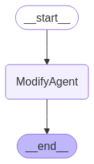

# Workflow Config Examples

## Table of Contents

- [Workflow Configuration Overview](#workflow-configuration-overview)
- [Sequential](#sequential)
- [Branching](#branching)
- [Evaluator-Optimizer](#evaluator-optimizer)
- [Explicit Edges](#explicit-edges)
- [Parallel](#parallel)
- [Routers](#routers)
- [Orchestrator-Worker](#orchestrator-worker)
- [Complex Combined Config](#complex-combined-config)
- [Local Embedding Retriever](#local-embedding-retriever)

---

## Workflow Configuration Overview

Each workflow is defined in a JSON config file. Key sections include:

- `agents`: List of agents and their settings.
- `edges`: Defines connections between agents.
- `orchestrator`, `evaluator_optimizer`, `parallel`, `branches`, `routers`: Advanced workflow logic.

See the main `Readme.md` for a full schema reference.

---

## Sequential


- Agents are executed one after another.
- Edges define the order.

**How it works:**

- Each agent processes the state and passes it to the next.

**Use case:**

- Step-by-step processing, e.g., document analysis pipeline.

Test prompt: `Use MCP tool to start workflow Provide information about Antarctica`

## Branching


- Workflow branches based on a condition.
- Each branch can have its own target agent(s).

**How it works:**

- Use the `branches` section with a `condition` lambda and `targets` mapping.

**Use case:**

- Classification, decision trees.

Test prompt: `Use MCP tool to start workflow Provide information about Nvidia RTX 3090 sales`

## Evaluator-Optimizer


- Adds evaluation and optimization steps to the workflow.

**How it works:**

- Use the `evaluator_optimizer` section to define evaluator, optimizer, and quality conditions.

**Use case:**

- Quality control, iterative improvement.

Test prompt: `Use MCP tool to start workflow Translate Is this really a evaluator optimized workflow? to French`

## Explicit Edges


**Use case:**

- Full control over workflow graph.

Test prompt: `Use MCP tool to start workflow to draft an email`

## Parallel


- Multiple agents run in parallel from a single source agent.
- Results are joined by a specified agent.

**How it works:**

- Use the `parallel` section to define source, nodes, and join agent.

**Use case:**

- Multi-perspective analysis, ensemble tasks.

Test prompt: `Use MCP tool to start workflow Agenda is to build a CICD pipeline`

## Routers


- Dynamic routing based on a function.

**How it works:**

- Use the `routers` section with a `router_function` lambda to select the next agent.

**Use case:**

- Smart dispatch, context-aware agent selection.

Test prompt: `Use MCP tool to start workflow I would like to change my email`

## Orchestrator-Worker


- An orchestrator agent manages multiple worker agents.

**How it works:**

- Define an `orchestrator` with a list of `workers`.

**Use case:**

- Task delegation, coordination.

Test prompt: `Use MCP tool to start workflow to read the ".gitignore" file`

## Complex Combined Config


- Mixes multiple patterns (sequential, parallel, branching, etc.) for advanced workflows.

**How it works:**

- Combine sections as needed for your use case.

**Use case:**

- Advanced, real-world workflows.

Test prompt:

```plaintext
Use MCP tool to start workflow Summarize the following news article: The "most intense global coral bleaching event ever" has so far struck 84 per cent of the world's reefs and is ongoing, the International Coral Reef Initiative (ICRI) — a global partnership between nations and non-governmental and international organizations focused on sustainable management of coral reefs — reported on Wednesday.

The new figure is far worse than previous events that hit 21 to 68 per cent of reefs.

But scientists say the reefs and the corals are not all dead yet and could still  bounce back if people take the right steps, including conservation and cutting greenhouse gas emissions.

Corals are small marine animals that live in colonies with colorful symbiotic algae that give them their rainbow hues and supply them with most of their food. But when the water gets too warm for too long, the algae release toxic compounds, and the corals expel them, leaving behind a white skeleton — causing "bleaching."
```

## Local Embedding Retriever


**How it works:**

- Use the `retrieve_embeddings` tool in agent configs to fetch vector embeddings.

**Use case:**

- Semantic search, context retrieval.

Test prompt:

```plaintext
1. Use MCP tool to embed files #file:Readme.md

2. Use MCP tool to start workflow to create an email about Agentic Workflow Server if it has custom embedding support
```

## Local Embedding Updater



**How it works:**

- Use the `modify_embeddings` tool in agent configs to fetch or update vector embeddings.

**Use case:**

- Keeping embeddings in sync with file changes.

Test prompt:

```plaintext
Use MCP tool to start workflow for folder `./config_examples`
```

---

**Tip:**

- Copy and adapt any example config from `config_examples` to your own `config.json`.
- Visualize your workflow using the `display_graph` tool for clarity.

For more details, see the main [`Readme.md`](../Readme.md).
